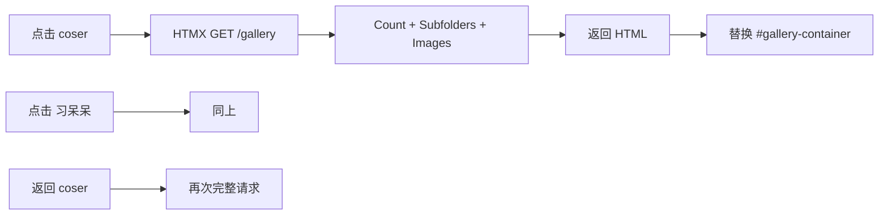

# 文件夹浏览速度优化方案

## 问题分析

当前流程：每次切换文件夹（包括返回父级）都会触发完整的 `/gallery` 请求：

**现状**：

- 服务端已有 `path_count` 缓存（内存 60s、DB 5min），但每次导航仍会发起请求
- `get_subfolders` 无缓存，每次都要查库
- 客户端无缓存，返回已访问路径时必然重新请求

**用户感受**：每次回到 coser 都要「加载中...」→ 刷新，体验不佳。

---

## 优化方案

### 方案一：客户端路径缓存（核心）

在 [static/js/gallery.js](static/js/gallery.js) 中增加 **gallery 响应缓存**：

- **缓存键**：`path + mode + sort_by + sort_order + page + cols + filter_`* 等（与 `buildGalleryUrl` 一致）
- **缓存内容**：`{ html, timestamp }`
- **策略**：LRU，最多约 30–50 条，TTL 5–10 分钟
- **流程**：
  1. 拦截文件夹链接点击（或 HTMX 请求前）
  2. 若缓存命中且未过期 → 直接 `innerHTML` 替换，更新 history，不发起请求
  3. 若未命中 → 正常请求，响应后写入缓存

**实现要点**：

- 在 `htmx:beforeRequest` 或自定义 `hx-trigger` 中检查缓存
- 或：用 `hx-get` 的 `hx-preserve` 思路，改为在 JS 中统一处理 gallery 导航，先查缓存再决定是否发请求
- 更简单做法：在 `htmx:configRequest` 中根据 URL 查缓存，若命中则 `ev.detail.detail.returnValue = false` 并手动 swap（需确认 HTMX 是否支持）

**更稳妥的实现**：不依赖 HTMX 拦截，而是：

- 给所有 gallery 导航链接加 `data-gallery-path` 等属性
- 用 `click` 事件委托：若缓存命中，`preventDefault()`，手动更新 `#gallery-container` 并 `history.pushState`
- 若未命中，让默认行为继续（或手动 `htmx.ajax`）

**缓存失效**：在以下操作后清除相关路径缓存：

- 上传、删除、移动、重命名、新建文件夹
- 调用 `refreshGallery` 时顺带清空缓存，或按路径前缀清除

---

### 方案二：服务端缓存增强（辅助）

1. **延长 path_count 内存 TTL**
  [utils/path_count_cache.py](utils/path_count_cache.py) 中 `_COUNT_CACHE_TTL` 从 60s 调整为 300s（与 DB 一致），减少短时间内重复 COUNT。
2. **子文件夹缓存（可选）**
  在 [utils/folder_tree.py](utils/folder_tree.py) 或 [main.py](main.py) 中为 `get_subfolders` 增加短期缓存：
  - 键：`(path, sort_by, sort_order)`
  - TTL：60–120 秒
  - 在 `invalidate_folder_tree_cache` 时一并失效

---

## 推荐实施顺序

1. **先做方案一**：客户端路径缓存，直接改善「返回 coser」的体验
2. **再做方案二**：服务端 TTL 调整 + 子文件夹缓存，降低服务端压力

---

## 涉及文件

| 文件                                                     | 改动                                                      |
| ------------------------------------------------------ | ------------------------------------------------------- |
| [static/js/gallery.js](static/js/gallery.js)           | 新增 `galleryPathCache` 模块，拦截/处理 gallery 导航，缓存命中时直接更新 DOM |
| [utils/path_count_cache.py](utils/path_count_cache.py) | `_COUNT_CACHE_TTL` 60 → 300                             |
| [utils/folder_tree.py](utils/folder_tree.py)           | （可选）为 `get_subfolders` 增加缓存                             |
| [main.py](main.py)                                     | （可选）在 gallery 中接入 subfolder 缓存                          |

---

## 注意事项

- 客户端缓存需在 `refreshGallery`、上传/删除/移动/重命名等操作后正确失效
- 筛选、搜索、分页等参数要纳入缓存键，避免展示错误数据
- 缓存容量不宜过大，避免占用过多内存（建议 30–50 条）

