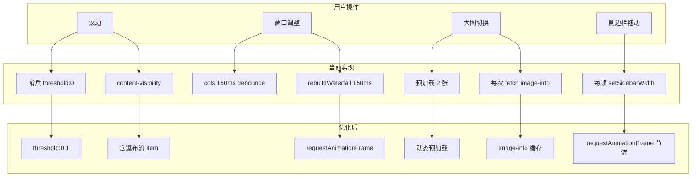

# FastPic 流畅度可优化点分析

## 一、瀑布流模式

### 1.1 瀑布流 item 缺少 content-visibility

**现状**：[base.html](templates/base.html) 中 `content-visibility: auto` 仅应用于 `#gallery-grid.gallery-flex > .selectable-item` 和 `#gallery-grid.gallery-list > .selectable-item`。瀑布流模式下 item 位于 `#wf-row > .wf-col` 内，选择器不匹配，**瀑布流 item 未享受视口外跳过渲染**。

**影响**：长列表滚动时，视口外大量 DOM 仍参与渲染，影响帧率。

**优化**：为 `#wf-row .wf-col .selectable-item` 添加 `content-visibility: auto` 和 `contain-intrinsic-size`。

---

### 1.2 瀑布流 initWaterfall / rebuildWaterfall 同步 DOM 操作

**现状**：[gallery.js](static/js/gallery.js) 第 1381-1429 行 `initWaterfall` 同步遍历所有 item，逐个 `placeItem` 执行 `appendChild`。`rebuildWaterfall`（1465-1500 行）会 remove 所有列、收集 item、再 append 回 grid，最后重新 init。

**影响**：数百张图片时，DOM 操作集中在主线程，可能造成 100ms+ 的阻塞，导致卡顿。

**优化**：

- 使用 `DocumentFragment` 批量 append，减少 reflow 次数
- 将 `distributeNew` 放入 `requestAnimationFrame` 延迟到下一帧，避免阻塞 HTMX 交换后的渲染
- 考虑虚拟化：仅渲染视口附近列，但改动较大

---

### 1.3 瀑布流 resize 重建

**现状**：resize 时 150ms debounce 后调用 `rebuildWaterfall`，会全量移除并重新分配所有 item。

**影响**：横竖屏切换或窗口调整时，可能短暂白屏或布局跳动。

**优化**：resize 时先保持旧布局，用 `requestAnimationFrame` 在下一帧执行 rebuild，减少与浏览器 resize 事件的竞争。

---

## 二、大图预览模式

### 2.1 预加载数量固定

**现状**：`MODAL_PRELOAD_COUNT = 2`（[gallery.js](static/js/gallery.js) 第 153 行），仅预加载前后各 2 张。

**影响**：快速滑动切换时，超出预加载范围的图片需等待加载，出现白屏或 loading 状态。

**优化**：

- 根据设备/网络动态调整：移动端可保持 2，桌面端可增至 3-4
- 根据滑动方向优先预加载：检测到连续向右滑时，增加右侧预加载数量

---

### 2.2 图片信息面板：每次切换都重新 fetch

**现状**：`refreshImageInfoIfVisible`（618-623 行）在每次 prev/next 后，若面板打开则调用 `showImageInfo`，后者会 `fetch('/api/image-info/' + imageId)`（433 行）。

**影响**：快速切换时产生大量重复请求，同一张图片可能被多次请求，且网络延迟会阻塞 UI 更新。

**优化**：增加内存缓存 `imageInfoCache[imageId]`，已请求过的直接使用缓存，避免重复 fetch。

---

### 2.3 大图切换的串行加载

**现状**：`_showModalContentWhenReady` 先 `new Image()` 预加载，加载完成后再 `_showModalContent`。若用户快速滑动，可能触发多次切换，但每次都要等前一张加载完才显示。

**影响**：快速滑动时，显示的可能是「过时」的图片，或需等待当前加载完成才能切换。

**优化**：为每次切换生成唯一 `requestId`，加载完成时校验 `requestId` 是否仍为当前请求，否则丢弃，避免过时图片覆盖正确图片。

---

### 2.4 openModalFromGallery 的 folder-images 请求

**现状**：打开大图后立即 `fetch('/api/folder-images?...')`（291 行），在后台拉取全量列表。该请求在百万级数据下可能较慢（最多 5000 条）。

**影响**：请求本身不阻塞 UI，但若与 image-info 等请求并发，可能加剧网络拥塞。且 5000 条 JSON 解析可能短暂占用主线程。

**优化**：可考虑 `requestIdleCallback` 延迟执行，或分批请求（如先 500 条，滚动到底时再加载）。

---

## 三、缩略图网格

### 3.1 首屏 eager 加载数量

**现状**：`is_first_screen = loop.index0 < (cols * 4)`（[gallery.html](templates/gallery.html) 第 264 行），8 列时首屏 32 张 `loading="eager"`。

**影响**：首屏请求过多，可能拖慢 LCP，弱网下尤其明显。

**优化**：改为 `cols * 3` 或根据视口高度估算首屏行数，减少首屏 eager 数量。

---

### 3.2 无限滚动哨兵触发过早

**现状**：`hx-trigger="intersect once root:#scroll-container threshold:0"`（325 行），哨兵一进入视口（0%）即触发加载。

**影响**：用户尚未滚动到底部时就开始加载下一页，可能造成不必要的请求和 DOM 增加。

**优化**：将 `threshold` 调整为 `0.1` 或 `0.2`，接近底部时再加载。

---

### 3.3 selectable-item 的 transition-all

**现状**：`transition-all` 应用于所有 selectable-item（[gallery.html](templates/gallery.html) 第 265 行）。

**影响**：`transition-all` 会监听所有属性变化，大量元素时可能增加样式计算开销。

**优化**：改为 `transition-colors` 或 `transition border-color, box-shadow`，仅保留实际需要过渡的属性。

---

## 四、交互与布局

### 4.1 侧边栏 resize 无节流

**现状** [gallery.js](static/js/gallery.js) 第 1316-1328 行：`mousemove` 直接调用 `setSidebarWidth`，每帧可能触发多次。

**影响**：拖动时可能造成不必要的 layout 计算和重绘。

**优化**：使用 `requestAnimationFrame` 节流，每帧最多执行一次 `setSidebarWidth`。

---

### 4.2 resize 事件重复触发

**现状**：`window.addEventListener('resize')` 有多处（1207、1507 行），分别处理 cols 和瀑布流，各自 150ms debounce。但 resize 可能连续触发。

**影响**：多个 timer 可能同时存在，造成重复计算。

**优化**：可考虑统一 resize 处理函数，合并 cols 与瀑布流逻辑，减少重复执行。

---

### 4.3 缩略图尺寸滑块拖动时的 refreshGallery

**现状**：`document.body.addEventListener('input')` 中，滑块拖动时 `setThumbnailCols(parseInt(e.target.value, 10), true)` 使用 `skipRefresh=true`，但关闭 popover 时会调用 `refreshGallery` 和 `rebuildWaterfall`，会全量刷新画廊。

**影响**：用户调整滑块后关闭 popover 时，可能感到明显卡顿。

**优化**：若仅列数变化，可考虑局部更新（如仅更新 CSS 变量）而非全量 HTMX 刷新，减少 DOM 替换。

---

## 五、后端与网络

### 5.1 folder-images 接口数据量

**现状**：最多返回 5000 条，百万级时查询可能较慢。

**影响**：大图模式从「当前页」切换到「全量」时，若文件夹很大，需等待较长时间。

**优化**：已支持分批加载（openModalFromGallery 先显示当前页，后台拉取全量）。可考虑服务端分页，如先返回 200 条，前端再按需请求更多。

---

### 5.2 image-info 接口无缓存

**现状**：每次请求都查 DB，无 HTTP 缓存头。

**影响**：同一张图片多次打开信息面板时，重复请求。

**优化**：可对 `get_image_info` 响应添加 `Cache-Control: private, max-age=60`，或前端内存缓存（见 2.2）。

---

## 六、优先级与实施建议

| 优先级 | 优化点                    | 影响范围         | 改动量 |
| --- | ---------------------- | ------------ | --- |
| 高   | 瀑布流 content-visibility | 瀑布流滚动帧率      | 小   |
| 高   | 图片信息缓存                 | 大图切换流畅度      | 小   |
| 高   | 侧边栏 resize 节流          | 拖动流畅度        | 小   |
| 中   | 大图预加载数量/策略             | 大图切换白屏       | 中   |
| 中   | 大图切换 requestId 防过时     | 快速滑动时显示正确    | 中   |
| 中   | transition-all 收窄      | 网格整体渲染       | 小   |
| 中   | 无限滚动 threshold         | 减少不必要的加载     | 小   |
| 低   | 瀑布流 DocumentFragment   | 首次加载/rebuild | 中   |
| 低   | 首屏 eager 数量            | 首屏加载         | 小   |
| 低   | resize 统一处理            | 代码整洁         | 中   |

---

## 七、架构示意

