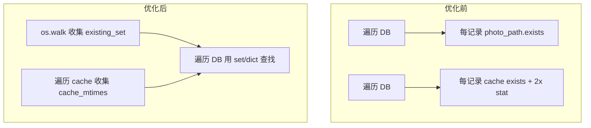

# FastPic 磁盘 I/O 性能优化计划

## 现状分析

项目已有多项 I/O 优化（批量 DB 操作、os.walk 替代 rglob、path_count 缓存等），但在百万级规模下仍有优化空间。主要 I/O 热点如下：


| 模块                      | 当前行为                                     | 影响               |
| ----------------------- | ---------------------------------------- | ---------------- |
| `stats_cache_only`      | 每次缓存失效时 `rglob("*.webp")` + 每文件 `stat()` | 百万级约 100 万次 stat |
| `cleanup_database` 步骤 1 | 每条 DB 记录 `photo_path.exists()`           | 百万级约 100 万次 stat |
| `cleanup_database` 步骤 3 | 每记录 `exists()` + 2 次 `stat()` 比较 mtime   | 约 300 万次 syscall |
| `get_stats`             | 每次请求可能触发 `stats_cache_only`              | 设置页访问即触发         |
| favicon                 | 每次请求 `favicon_path.exists()`             | 低影响但可消除          |


---

## 优化方案

### 1. stats_cache_only：用 DB 统计替代 rglob（高优先级）

**文件**: [utils/stats.py](utils/stats.py)、[routers/settings.py](routers/settings.py)

**现状**: `get_stats` 每次调用 `stats_cache_only`，即使已有 `cache_count = image_count + video_count`，仍会执行 rglob 做校验。

**方案**:

- 默认使用 DB 统计：`cache_count = image_count + video_count`，`cache_size` 用 `SUM(Image.file_size)` 乘近似系数（如 0.15，webp 压缩比）估算
- 仅在「怀疑不一致」时执行 rglob：例如 scan/cleanup 后设置标志，下次 stats 请求时执行一次 rglob 校验并清除标志；或完全移除 rglob，仅依赖 DB
- 若需保留精确 cache_size：可改为后台异步任务定期（如每小时）执行 rglob，结果写入内存/DB，stats 接口只读缓存

**推荐**: 完全移除 stats 中的 rglob，`cache_count` 和 `cache_size` 均从 DB 派生。`cache_size` 用 `SUM(file_size) * 0.15` 估算，并在 UI 标注「估算值」。这样设置页访问零磁盘 I/O。

---

### 2. cleanup_database：用一次 os.walk 替代 N 次 exists（高优先级）

**文件**: [scanner.py](scanner.py)

**步骤 1 优化**（清除幽灵记录）:

- 先执行一次 `os.walk(photos_dir)` 收集 `existing_rel_paths: set[str]`
- 遍历 DB 时用 `img.relative_path in existing_rel_paths` 替代 `photo_path.exists()`
- 从 O(N) 次 stat 降为 O(D) 次 listdir（D=目录数） + O(N) 次 set 查找

**步骤 2+3 合并优化**（孤儿清理 + 缺失缓存补全）:

- 在步骤 2 遍历 cache 三层目录时，同时收集 `cache_mtimes: dict[str, float]`（key 为 `cache_filename(rel_path)` 格式）
- 步骤 3 判断逻辑改为：
  - `img.relative_path not in existing_rel_paths` → 跳过（原图已删）
  - `cache_name in cache_mtimes and cache_mtimes[cache_name] >= img.modified_at` → 跳过（缓存新鲜，用 DB 的 modified_at 替代 photo stat）
  - 否则加入 `to_regen`
- 消除步骤 3 中每条记录的 `cache_path.exists()`、`photo_path.exists()`、`photo_path.stat()`、`cache_path.stat()` 共最多 4 次 syscall




---

### 3. 哈希计算：分块读取大文件（中优先级）

**文件**: [routers/images.py](routers/images.py)、[utils/hash_utils.py](utils/hash_utils.py)

**现状**: `read_bytes()` 将整个文件读入内存，大文件（如 4K 视频）可能导致内存峰值。

**方案**: 改用分块读取，I/O 总量不变，但降低内存占用、避免大文件 OOM：

```python
def _compute_file_md5(path: Path) -> str:
    h = hashlib.md5()
    with open(path, "rb") as f:
        for chunk in iter(lambda: f.read(65536), b""):
            h.update(chunk)
    return h.hexdigest()
```

---

### 4. favicon：启动时检查一次（低优先级）

**文件**: [main.py](main.py)

**方案**: 在 lifespan 或模块加载时检查一次，将结果存为模块级变量；`favicon()` 直接根据该变量返回，不再每次 `exists()`。

---

### 5. 可选：folder_tree 深层目录用 DB 替代 iterdir

**文件**: [utils/folder_tree.py](utils/folder_tree.py)

**现状**: `_scan_dirs` 递归 `iterdir()` 到 `_FOLDER_TREE_MAX_DEPTH=4`，深层目录仍会遍历文件系统。

**方案**: 当 `len(prefix) >= _FOLDER_TREE_MAX_DEPTH - 1` 时，子文件夹列表可从 DB 的 `relative_path` 前缀解析得到，无需 `iterdir`。实现较复杂，收益中等，可列为后续优化。

---

## 实施顺序建议

1. **cleanup_database 优化**（scanner.py）— 收益最大，cleanup 是启动时和定期执行的重 I/O 操作
2. **stats_cache_only 优化**（utils/stats.py + routers/settings.py）— 设置页访问频繁时收益明显
3. **哈希分块读取**（routers/images.py + utils/hash_utils.py）— 提升大文件上传场景稳定性
4. **favicon 缓存**（main.py）— 改动小，顺手完成

---

## 风险与回退

- stats 移除 rglob 后，cache 统计将依赖 DB，若存在大量孤儿/缺失缓存，显示数字会与文件系统不完全一致。可保留一个「手动刷新」按钮，按需触发一次 rglob 并更新显示。
- cleanup 的 `existing_set` 在百万文件时内存约几十 MB（set of str），可接受。

