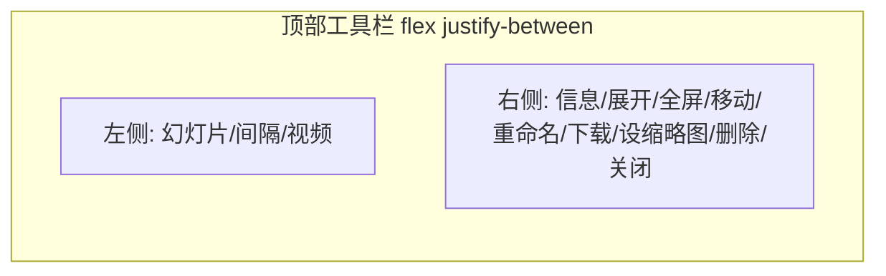

# 移动端大图浏览体验优化

## 问题分析

当前大图预览模态框顶部工具栏布局：




- **桌面端**：`justify-between` 将左右两组推到两端，空间充足无重叠
- **移动端**：右侧展开后约 9 个按钮（~350px+），在窄屏（如 375px）下会溢出并遮挡左侧控件

相关文件：

- [templates/index.html](templates/index.html) 第 166-268 行：模态框工具栏结构
- [static/js/gallery.js](static/js/gallery.js) 第 382-410 行：`applyModalToolbarState` / `toggleModalToolbar`
- [templates/base.html](templates/base.html)：全局样式（含 `@media (max-width: 767px)`）

## 解决方案

### 1. 移动端工具栏双行布局（核心修复）

当工具栏在移动端展开时，改为**垂直堆叠**：左侧控件独占第一行，右侧控件独占第二行，避免横向重叠。

**实现步骤：**

1. **为工具栏容器添加 id**（[index.html](templates/index.html) 第 166 行）：
  - 在 `class="absolute top-0 left-0 right-0 flex items-center justify-between p-4 z-10"` 的 div 上增加 `id="modal-toolbar"`
2. **在 JS 中同步展开状态到父容器**（[gallery.js](static/js/gallery.js) 第 388-404 行）：
  - 在 `applyModalToolbarState` 中，根据 `collapsed` 为 `#modal-toolbar` 添加/移除 class `modal-toolbar-expanded`
  - 展开时添加，收起时移除
3. **添加移动端专用 CSS**（[base.html](templates/base.html) 的 `<style>` 块内）：

```css
   /* 移动端：工具栏展开时改为双行布局，避免左右重叠 */
   @media (max-width: 767px) {
     #modal-toolbar.modal-toolbar-expanded {
       flex-direction: column;
       align-items: stretch;
       gap: 0.75rem;
     }
     #modal-toolbar.modal-toolbar-expanded > div:last-child {
       flex-wrap: wrap;
       justify-content: flex-end;
       gap: 0.5rem;
     }
   }
   

```

1. **模态框打开时应用初始状态**：确保 `openModal` 或首次打开时调用 `applyModalToolbarState`，以便移动端初始状态正确。需检查 [gallery.js](static/js/gallery.js) 中 `openModal` 是否已调用。

### 2. 移动端工具栏内边距微调（可选）

将 `p-4` 改为响应式：移动端 `p-3`，桌面端保持 `p-4`，节省垂直空间：

```html
class="... p-3 md:p-4 ..."
```

### 3. Popover 视口约束（可选增强）

`set-thumbnail-popover` 通过 JS 定位（[gallery.js](static/js/gallery.js) 第 899-916 行），在窄屏下可能超出左边界。可在 `toggleSetThumbnailPopover` 中增加边界检测，确保 `left >= 1rem`，避免溢出。

## 修改文件清单


| 文件                                           | 修改内容                                                                                                                    |
| -------------------------------------------- | ----------------------------------------------------------------------------------------------------------------------- |
| [templates/index.html](templates/index.html) | 工具栏 div 添加 `id="modal-toolbar"`，`p-4` 改为 `p-3 md:p-4`                                                                   |
| [static/js/gallery.js](static/js/gallery.js) | `applyModalToolbarState` 中为 `#modal-toolbar` 添加/移除 `modal-toolbar-expanded`；可选：`toggleSetThumbnailPopover` 增加 left 边界约束 |
| [templates/base.html](templates/base.html)   | 在 `<style>` 中增加上述 `@media (max-width: 767px)` 规则                                                                        |


## 验证方式

1. 在 Chrome DevTools 中切换到移动设备模拟（如 iPhone SE 375px）
2. 打开任意图片进入大图预览
3. 点击右侧「展开」按钮（三条横线图标）
4. 确认：左侧幻灯片控件在上方一行，右侧操作按钮在下方一行，无重叠
5. 收起工具栏后，确认布局恢复正常

