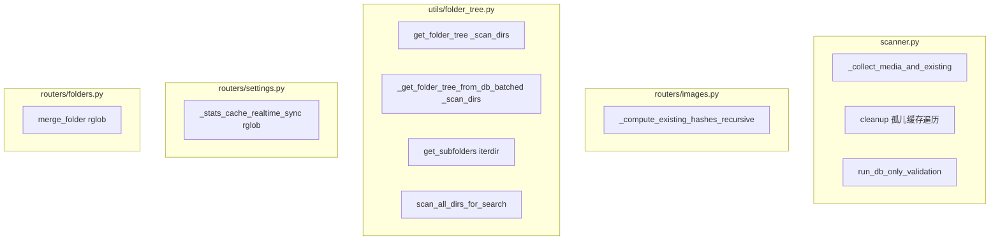
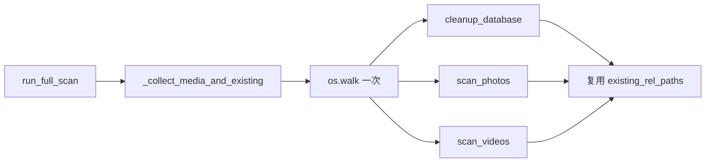

# 递归 FS 扫描行为分析与优化空间

## 一、递归/遍历 FS 行为全景

---

## 二、各模块详细分析

### 1. scanner.py —— 已较好优化

| 行为                            | 位置       | 说明                                                                                                    |
| ----------------------------- | -------- | ----------------------------------------------------------------------------------------------------- |
| `_collect_media_and_existing` | L209     | 一次 `os.walk(photos_dir)` 收集 images/videos/existing_rel_paths，供 cleanup + scan_photos + scan_videos 复用 |
| 孤儿缓存清理                        | L536-563 | 三层 `iterdir()` 遍历 cache 目录（`xx/xx/xx.webp` 结构），同时收集 `cache_mtimes`，步骤 3 用 DB 比较，无额外 stat              |
| `run_db_only_validation`      | L439-461 | 仅遍历 DB，对每条记录 `full_path.exists()` 校验，无 os.walk                                                        |

**优化空间**：

- `run_db_only_validation` 在百万级时仍会做 N 次 `exists()`。若希望进一步减少 I/O，可改为「分批 os.walk 收集 existing_rel_paths」再与 DB 比对，但 SKIP_FULL_SCAN 场景本身就是为了避免 os.walk，权衡后当前设计合理。

---

### 2. routers/images.py —— 上传去重哈希

| 行为                                     | 位置     | 说明                                                                 |
| -------------------------------------- | ------ | ------------------------------------------------------------------ |
| `_compute_existing_hashes`             | L33-43 | 仅根目录 `iterdir()`，非递归                                               |
| `_compute_existing_hashes_recursive`   | L46-68 | 递归 `iterdir()` + 每文件 `compute_file_md5_by_path`，用于**文件夹上传**时按子目录哈希 |
| `_compute_existing_hashes_for_subdirs` | L70-92 | 仅对 `subdirs` 指定的子目录调用 recursive，避免全图库扫描                            |

**优化空间**：

- 已按需哈希（只扫即将写入的子目录），设计合理。
- 若子目录内文件极多，可考虑：只对「即将写入的路径」做哈希，而非整个子目录；或对超大子目录做「采样/跳过」策略。收益取决于实际上传场景。

---

### 3. utils/folder_tree.py —— 主要优化点

| 行为                                                | 位置       | 说明                                                                   |
| ------------------------------------------------- | -------- | -------------------------------------------------------------------- |
| `get_folder_tree` 中 `_scan_dirs`                  | L38-46   | 递归 `iterdir()` 全 photos 目录，深度无限制                                     |
| `_get_folder_tree_from_db_batched` 中 `_scan_dirs` | L304-312 | 递归 `iterdir()` 到 `_FOLDER_TREE_MAX_DEPTH=4`，用 `asyncio.to_thread` 执行 |
| `get_subfolders` 中 iterdir                        | L404-409 | 当 `len(agg_rows) < 50` 时，对**单层** `fs_dir.iterdir()` 补充空目录            |
| `scan_all_dirs_for_search`                        | L455-464 | **死代码**：递归扫描全目录，从未被调用                                                |

**优化空间（高）**：

1. **移除死代码**：`scan_all_dirs_for_search` 可删除，`search_dirs` 已改用 `get_folder_counts_for_search`（纯 DB）。
2. **folder_tree 深层用 DB 替代 iterdir**：当 `len(prefix) >= _FOLDER_TREE_MAX_DEPTH - 1` 时，子文件夹可从 `relative_path` 前缀解析，无需 `iterdir`。现有计划已提及，实现复杂度中等。
3. **get_folder_tree 无 session 路径**：`get_folder_tree_cached(photos_dir, rel_paths, session=None)` 在无 session 时走 `get_folder_tree`，会全量 `_scan_dirs`。若调用方总是有 session，可统一走 DB 路径，避免该分支的 FS 遍历。

---

### 4. routers/settings.py —— 按需 rglob

| 行为                           | 位置       | 说明                                                                              |
| ---------------------------- | -------- | ------------------------------------------------------------------------------- |
| `_stats_cache_realtime_sync` | L144-154 | `CACHE_DIR.rglob("*.webp")` + 每文件 `stat()`，仅用于**手动刷新** cache 统计                 |
| `trigger_scan`               | L56-68   | 调用 `_collect_media_and_existing`，一次 os.walk，复用给 scan                            |
| `trigger_cleanup`            | L71-79   | 调用 `cleanup_database`，无 existing_rel_paths 时会内部再调 `_collect_media_and_existing` |

**优化空间**：

- `trigger_cleanup` 单独调用时会产生一次 os.walk；若与 scan 串联（如设置页「完整同步」），可考虑合并为一次 walk。当前 `trigger_cleanup` 独立调用场景下，无法复用 scan 的预收集结果，属合理设计。
- `_stats_cache_realtime_sync` 已是按需调用，保留用于「手动刷新」合理。

---

### 5. routers/folders.py —— 合并文件夹时的 rglob

| 行为                   | 位置       | 说明                                                              |
| -------------------- | -------- | --------------------------------------------------------------- |
| `merge_folder` 删除空目录 | L588-598 | `source_path.rglob("*")` 按路径深度逆序，逐个 `iterdir()` 检查是否为空后 `rmdir` |

**优化空间（中）**：

- `rglob("*")` 会遍历 source 下所有路径。可改为 `os.walk(..., topdown=False)` 自底向上遍历，逻辑等价且更符合「删空目录」语义，部分实现可能略高效。
- 或：仅对「DB 中无图片的目录」做删除判断，减少需检查的目录数；但需处理「空目录但 DB 无记录」的边界，实现更复杂。收益取决于合并操作频率。

---

### 6. watcher.py —— 事件驱动，无递归扫描

- `observer.schedule(..., recursive=True)` 为 watchdog 的递归监听配置，非主动扫描，无额外 FS 遍历。

---

## 三、优化建议汇总

| 优先级 | 项目                 | 文件                                           | 改动                                                                                                   |
| --- | ------------------ | -------------------------------------------- | ---------------------------------------------------------------------------------------------------- |
| 高   | 移除死代码              | [utils/folder_tree.py](utils/folder_tree.py) | 删除 `scan_all_dirs_for_search`（约 L455-464）                                                            |
| 中   | folder_tree 深层用 DB | [utils/folder_tree.py](utils/folder_tree.py) | `_scan_dirs` 在 `len(prefix) >= _FOLDER_TREE_MAX_DEPTH - 1` 时，从 DB `relative_path` 解析子目录，不再 `iterdir` |
| 中   | merge 空目录删除        | [routers/folders.py](routers/folders.py)     | 用 `os.walk(..., topdown=False)` 替代 `rglob("*")`，自底向上删空目录                                             |
| 低   | trigger_cleanup 复用 | [routers/settings.py](routers/settings.py)   | 若存在「完整同步」流程，可合并 scan+cleanup 为一次 `run_full_scan`，避免用户分别点击时重复 os.walk                                 |

---

## 四、数据流示意（当前 run_full_scan）

---

## 五、结论

- **scanner**：已通过一次 os.walk + 复用，将 cleanup/scan_photos/scan_videos 合并，优化到位。
- **folder_tree**：存在死代码和深层 iterdir 可优化点，建议优先处理。
- **folders merge**：rglob 可改为 os.walk 自底向上，收益中等。
- **images 上传**：按子目录哈希已避免全图库扫描，进一步优化取决于实际上传规模。

